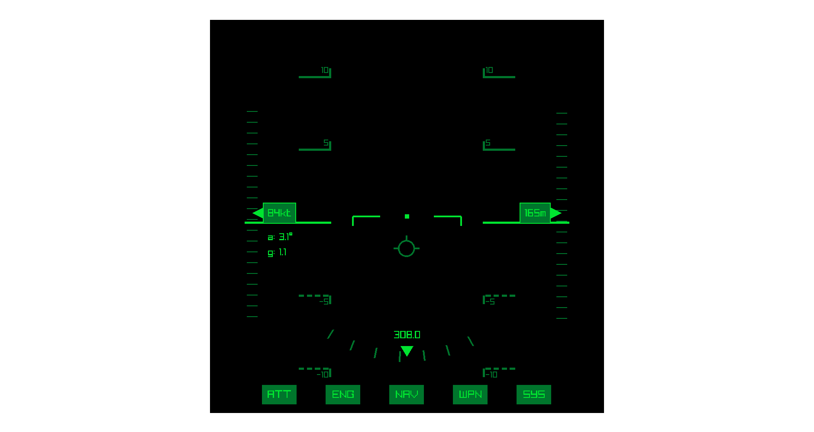
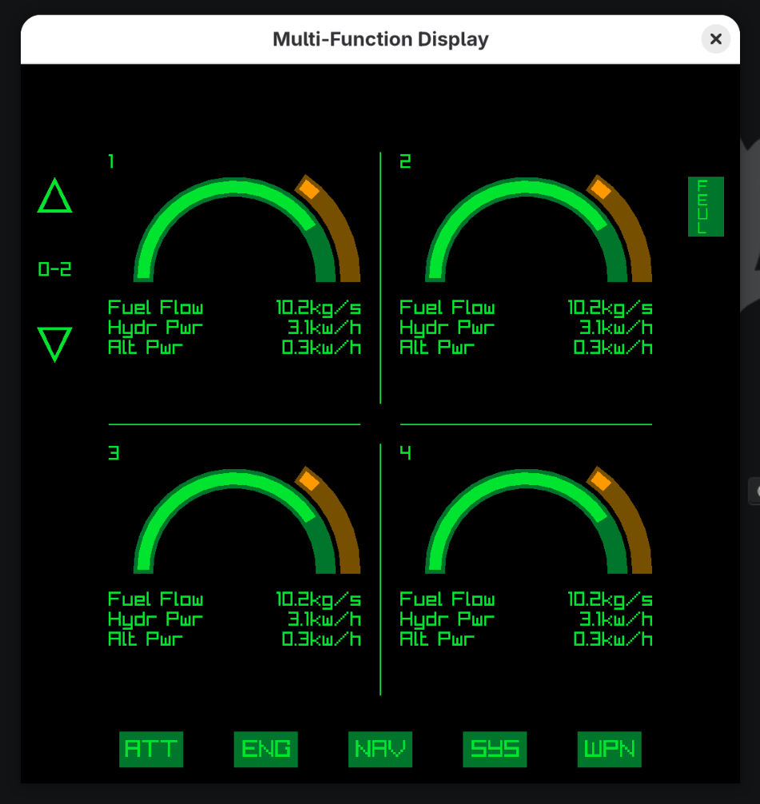
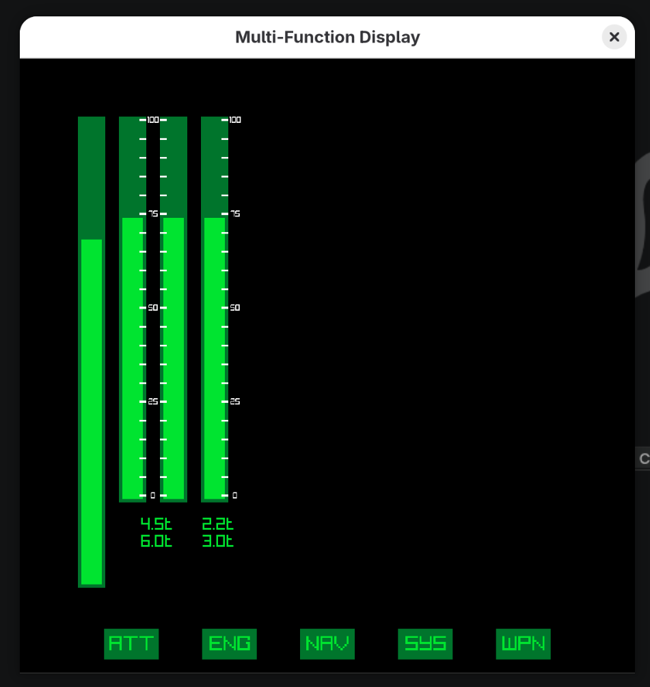
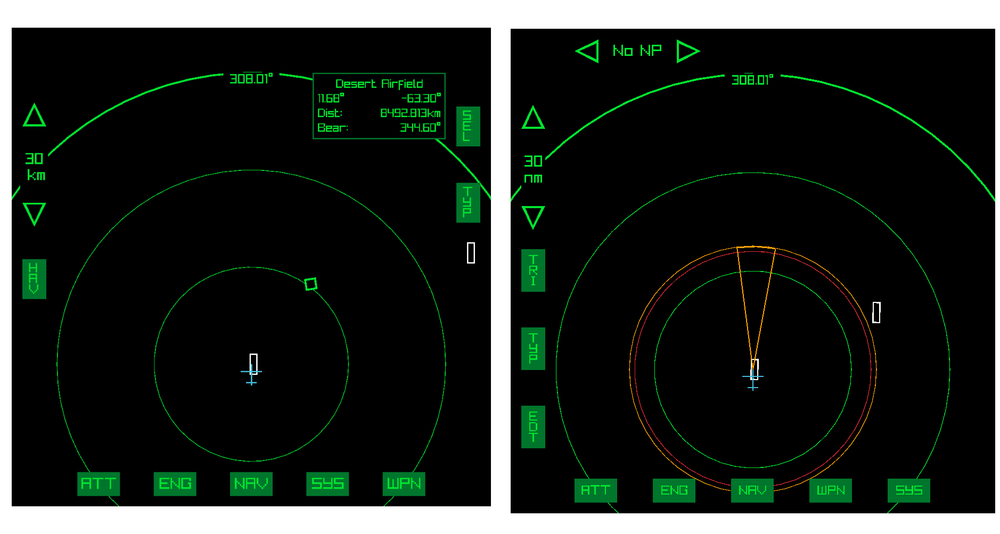
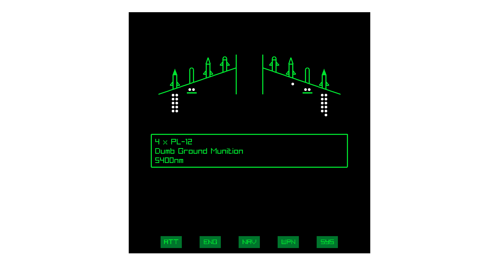

# Multifunction Display

Multifunction Display for Flyout (Yayyyyyyyyyyyyyyyyyy)

The app connects to Flyout via the [Flyout Data Socket](https://github.com/notUnknuffig/FlyoutDataSocket) (also a project of mine). It will give the app all data you need from flyout and display it in a nice way.

## What I currently plan to make:

- Attitude Indicator/HUD (stuff you would find in a HUD)
- Engine (Throttle/Fuel Flow/Power/RPM)
- Fuel
- Navigation (With navigations points and airfields to navigate to)
- Weapons (Count of missiles)
- Other Systems (I am not sure yet but maybe like reading some custom axis values)

## Input

You will need to use the Function Keys and Arrow Keys to navigate the app. The are currently no hints to what is doing what, and the keys are also pretty random... sooooo, you'll need to figure this out on your own... (sorry :3)

I don't really plan to add clickable buttons, because i hate touchscreens in aircraft. I just want to have buttons to press. I also made this with a MFD panel for flightsimming in mind.

## Info Screens

### HUD

The hud or attitude display shows some values you would find in the hud in flyout, but with some extras. Your heading indicator also shows the bearing of your navigation target.

-> I want to add some more stuff rigth here...

### Engines

The engines display shows you detailed information about each engine in the aircraft, both piston and turbine engine.

You can name your engines `MFD-invis-some-engine` (`MFD-invis` just needs to be included) and your engine will not show up in the display, great hiding engines used for VTOL for example. For piston engines (also works with turbines) you can use `MFD-once-some-engine` so that all instances of engines with that name are added up (or averaged), good for block engines.

With `<up-arrow>` and `<down-arrow>` you can scroll through the engines if you have more than four.

With `<F6>` you can view detailed stats of fuel tanks. Each fuel tank is listed with it's capacity.

-> I currently plan the rewrite some stuff, so that the fuel tanks are properly ordered and the total fuel display thingy also shows max fuel as well as fuel flow.

### Navigation

The navigation display shows you the map of objects around you. Airfields are read from `Areas.txt` and (hopefully) correctly displayed with its heading matching the spawn points.

You can change the scale of the map with `<up-arrow>` and `<down-arrow>`. The thick line shows you the range you specified (i.e. 50 km). With `<F6>` you can switch you display mode between trigonometric and haversine calculations for the distance. Haversine is the correct formula for calculating distacnes on a sphere, but i am bad at math sooooo... let's not trust my abilities and use the trigonometric distance formula, which is correct most of the times for close distances.

With `<F7>` you can enter select mode, while in select mode you can use `<left-arrow>` and `<right-arrow>` to select objects to navigate towards. With `<F8>` you can swap between navigating to nav-points or airfields. If the navigation target is outside the view a diamond will show you which heading you should follow. There is also some data about your target like distance.

You can add new navigation points with the `EDT` button.

The display also shows the radar scan area (orange) and weapon range (red).

-> Storing navigation point data would be so nice because using the editing panel is pain.

-> I want to do targeting data but i just don't know how to get it from flyout T-T

-> I don't know how big the world of flyout is, i found a number of about 10,000km radius. But i have also seen a navigation tool which used around 9,000km. Because i didn't do any testing so the distances might be off by a bit.

### Weapons

The weapons panel shows you detailes about your missiles and bombs. Currently you can display up to 10 weapons (Any more weapons will just not be shown). The type of weapon and the shape is defined by the guidance system setting in the missile core.

### Systems

-> I have no clue what to display here, but maybe like reading custom axis values... you could name you axis like `MFD-axis-some name` and display it here as `some name` with a bar for sliders and light for switches, or steps.

-> also displaying flaps with one of these wing thingy displays.
